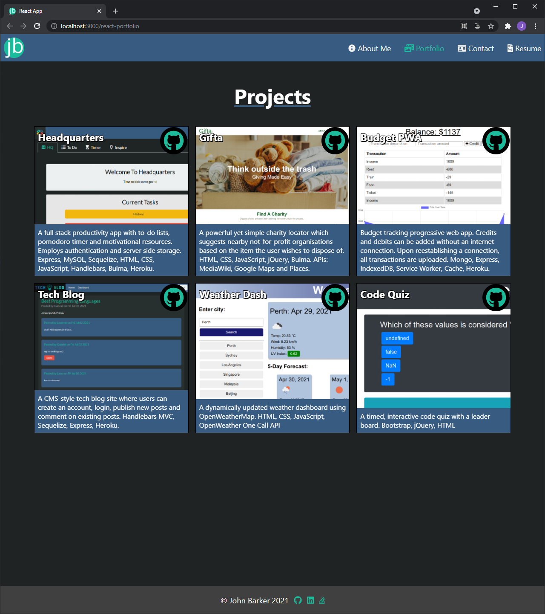

# React Portfolio

## Description

This repository contains John Barker's React.js portfolio.

It showcases previous projects, a contact form, a resume and associated proficiencies. The footer has links to GitHub, LinkedIn and Stack Overflow profiles.

## Table of Contents:

- [Usage](#usage)
- [License](#license)
- [Questions](#questions)

### Usage

The deployed website can be viewed here: https://dandycodes.github.io/react-portfolio/

### License

Copyright (c) John Barker. All rights reserved.

Licensed under the [MIT](LICENSE) license.

### Questions

If you have any questions, head to my [GitHub](https://github.com/DandyCodes) or send me an email at jdabarker@gmail.com.
